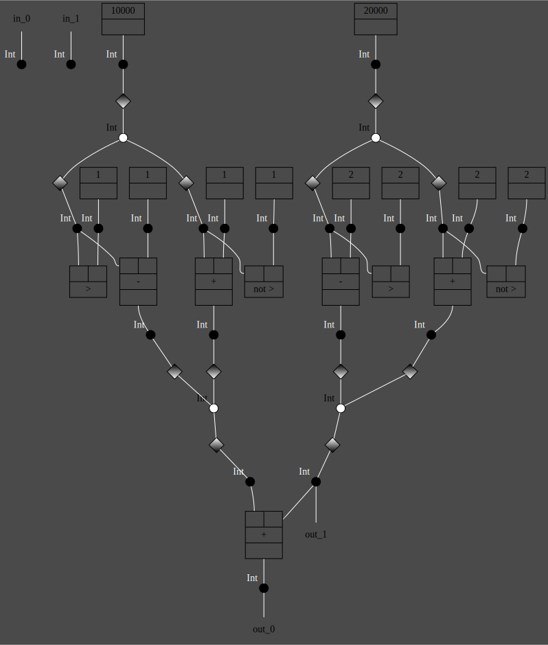

# TapePy

> Python IR based on Tape Diagrams

This is a proof-of-concept instance of the tape semantics for imperative programs introduced in [1].

We define a tape semantics for a very small subset of Python. The goal is to show that it is possible to build a _real_ compiler grounded in Category Theory for _real_ programming languages. We use Python, but _any_ language could work, making a tape-based IR ideal for multi-frontend/multi-backend compilers.

The intuition behind this approach is that we can represent programs as a multi-layer algebra: one layer describes data dependencies, and the other encodes alternative control flow. The idea is not new (see for example [3]), but it has not, to our knowledge, been explored in practice for compiler design and optimization.

The main advantage is that it can surface parallelism in programs, making the IR suitable for optimizations targeting GPUs and similar architectures. For example, let's consider this simple sequential Python program. The two if statements are independent because they don't share data dependencies.

```python
x = 10000
y = 20000

if x > 1:
    x = x - 1
else:
    x = x + 1

if y > 2:
    y = y - 2
else:
    y = y + 2

x = x + y
```

We convert the program into a monomial tape representation, which we then map to a two-color hypergraph. The two colors correspond to the two types of “tensors” used in tape diagrams. In this example, programs that differ only in how their operations are scheduled in parallel, up to certain Frobenius rewrites, end up producing the same hypergraph. The final result illustrates two if statements that can be executed in parallel.



## Getting started

Generate a diagram from the example program:

```bash
cargo run -- --home-folder .tapepy compile examples/surfacing_parallelism.py
```

## References

1. Bonchi, Filippo, Alessandro Di Giorgio, and Elena Di Lavore. "A Diagrammatic Algebra for Program Logics." International Conference on Foundations of Software Science and Computation Structures. Cham: Springer Nature Switzerland, 2025. [pdf](https://arxiv.org/abs/2410.03561)
2. Bonchi, Filippo, Alessandro Di Giorgio, and Alessio Santamaria. "Deconstructing the calculus of relations with tape diagrams." Proceedings of the ACM on Programming Languages 7.POPL (2023): 1864-1894. [pdf](https://dl.acm.org/doi/pdf/10.1145/3571257)
3. Stefanescu, Gheorghe. Network algebra. Springer Science & Business Media, 2000.

Based on [open-hypergraphs](https://github.com/hellas-ai/open-hypergraphs).
